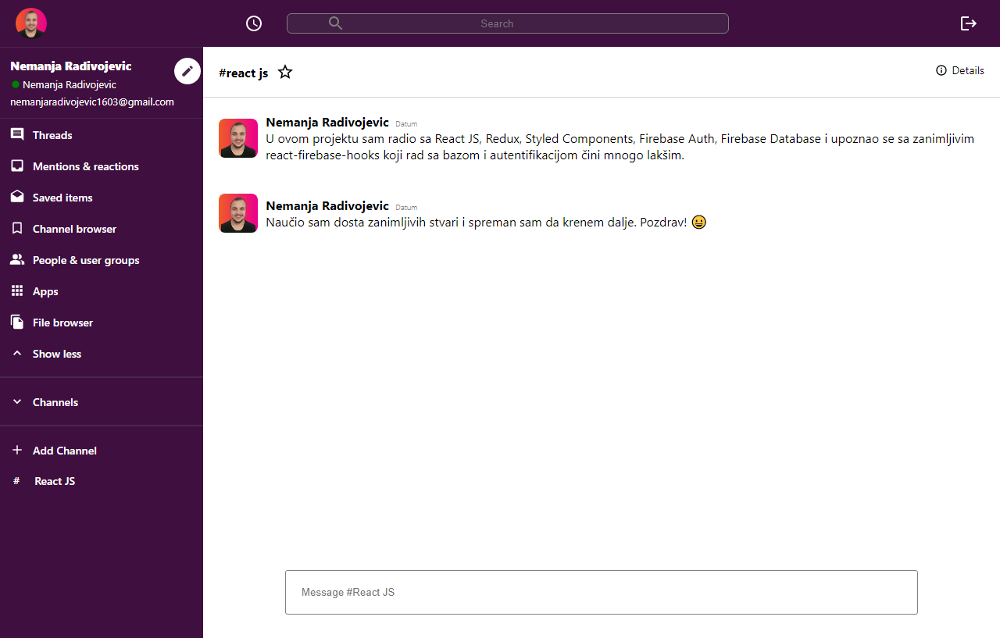

# Slack Clone

<a href="https://slack-clone-51ab5.web.app/" target="_blank">WEBSITE LINK</a>

## Desktop Version

## Available Scripts

In the project directory, you can run:

### `npm start`

Runs the app in the development mode.\
Open [http://localhost:3000](http://localhost:3000) to view it in your browser.
